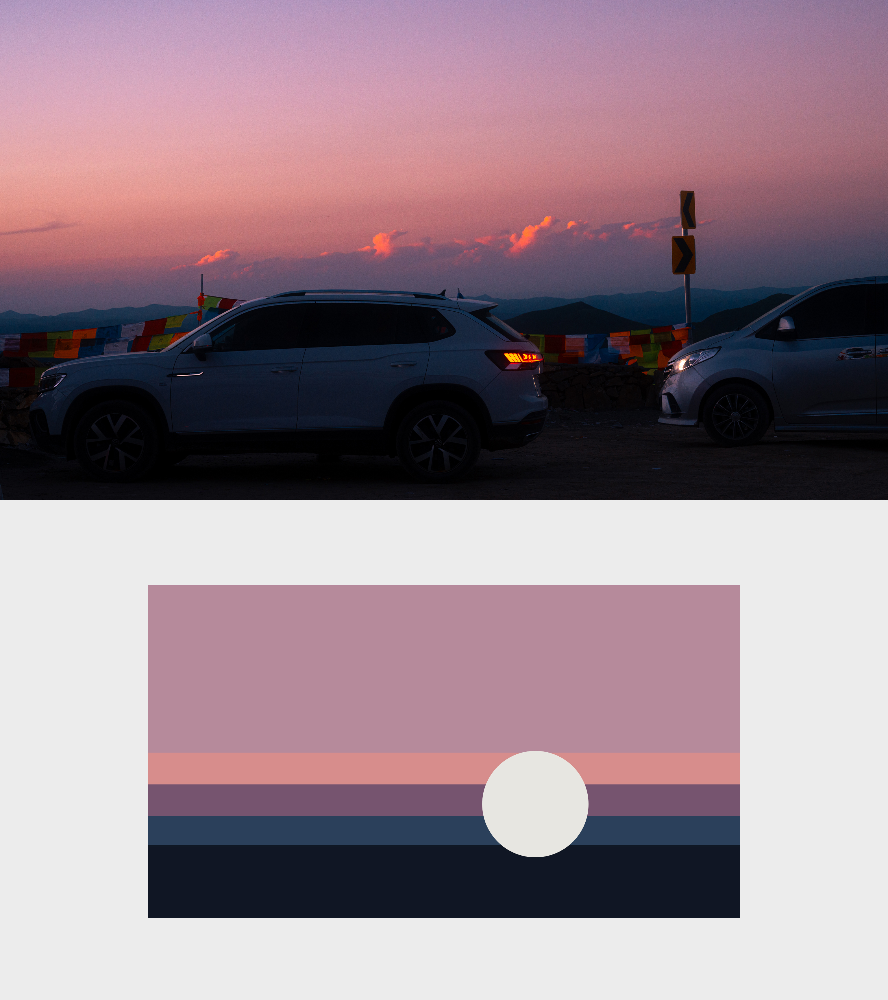
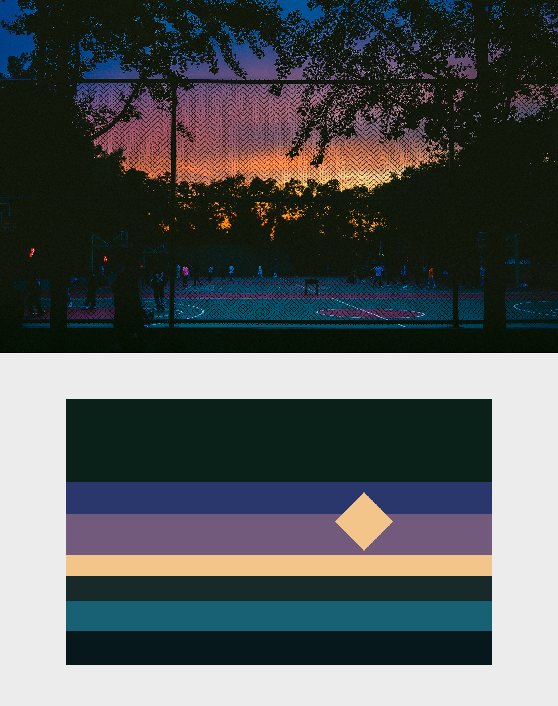

# Photo Chromatic Abstraction · Style 1

将照片转译为“色彩优先”的极简色彩记忆构成：保留主导色彩权重、冷暖关系、宽泛层次与视觉节奏，同时删除具体场景、物体细节和叙事噪声。

This Codex skill translates a photograph into a color-first chromatic-memory abstraction, delivered as an editable SVG and a PNG preview.

## 它适合什么

- 照片色彩记忆、色块抽象、色彩构成和照片色卡转译
- 以大片平面色域为主体、配合 1–5 个来源明确的克制点缀
- 希望先看到色彩构成，之后才联想到原照片的作品

如果作品必须保留原图中特定物体的位置、比例、相邻关系或几何结构，请改用 Structure-first 的 Style 2。

## 安装

将整个仓库文件夹放入 Codex skills 目录：

```text
~/.codex/skills/photo-chromatic-abstraction-style-1/
```

也可以克隆仓库后再复制到该目录：

```powershell
git clone https://github.com/ZzzLc0405/photo-chromatic-abstraction-style-1.git
```

安装完成后开启一个新的 Codex 对话，使 Skill 被重新发现。

## 使用方法

1. 在 Codex 中上传或指定一张照片。
2. 明确调用 Skill，例如：

   ```text
   使用 $photo-chromatic-abstraction-style-1，将这张照片转译成色彩优先的极简色彩记忆构成。
   ```

   或使用英文：

   ```text
   Use $photo-chromatic-abstraction-style-1 to translate this photo into an editable Style-1 chromatic memory composition.
   ```

3. 默认输出：

   - 可编辑 SVG
   - PNG 预览图

4. 如需原照片与抽象图同框展示，可额外提出：

   ```text
   同时生成适合发布的对照 composite，保持原照片不裁切、不重绘。
   ```

Skill 会根据照片自适应选择色域数量、色域比例、分隔方式、点缀形状与位置。示例只用于校准抽象深度和克制程度，不是可重复套用的模板。

## 示例

| 云层群组：不等大的圆形点缀 | 暮色：单圆点缀 |
| --- | --- |
|  |  |
| 暮色：单菱形点缀 | 月色与植被：单圆点缀 |
|  |  |

## 输出约束

- 只使用来源照片中的色彩与视觉事件。
- 默认使用 4–7 种颜色，总数不超过 8 种。
- 使用 1–5 个点缀实例，默认一个形状家族，最多两个。
- 不使用渐变、滤镜、纹理、阴影、透明度、描边、文字或嵌入式照片。
- 不重建人物、车辆、建筑、树木等对象的完整轮廓。

生成 SVG 后，可运行内置验证器：

```powershell
python scripts/validate_style1_svg.py <output.svg>
```

## 版权与授权

Copyright © 2026 AM. All rights reserved.

- 个人学习、研究与非商业创作可以使用，但应保留原始版权声明。
- **任何商业用途都必须事先联系作者并取得明确授权**，包括商业产品、收费服务、客户项目、广告、品牌内容、付费课程、商业出版及其他直接或间接营利用途。
- 在社交媒体、视频平台、博客、新闻媒体或其他公共渠道发布、转载或展示相关作品时，请清晰标注 **`@AM.`**；条件允许时，也请附上本仓库链接。
- 未经授权，不得出售、再许可或将本 Skill 作为商业资源包的一部分重新分发。

完整条款见 [LICENSE](LICENSE)。商业授权可通过本仓库 Issues 或作者的 GitHub 主页联系。

